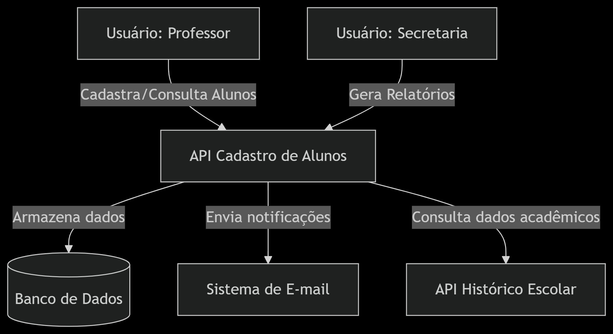
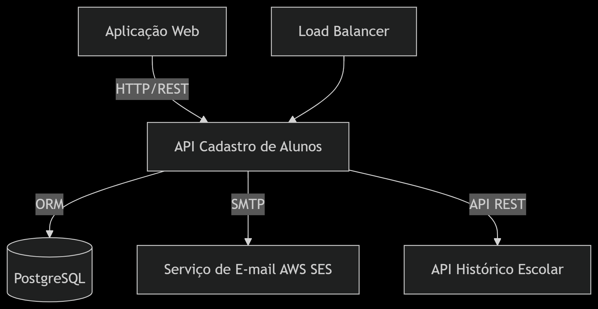
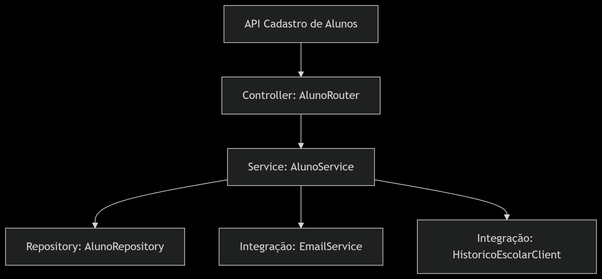

# Cadastro de Alunos API

Este é um projeto de API REST para cadastro de alunos, desenvolvido seguindo o modelo C4 de arquitetura.

## 📚 Documentação do Projeto

Para uma compreensão completa do projeto, incluindo a análise de requisitos e a história contada pela equipe, consulte a [História do Projeto](docs/project-history.md). Este documento detalha os problemas identificados, os atores principais, interações com sistemas externos e os objetivos gerais da solução.

## Visão Geral
O Modelo C4 é uma forma de documentar a arquitetura de software através de quatro níveis de abstração, cada um com um propósito específico e público-alvo diferente.

## Níveis do Modelo C4

### 1. Nível de Contexto (C1) – Diagrama de Sistema
**Público**: Stakeholders não técnicos (gestores, clientes)

**Foco**: Como o sistema se relaciona com usuários e sistemas externos.



**Atores**:
- Professores
- Secretaria

**Sistemas externos**:
- Banco de Dados
- Sistema de E-mail
- API Histórico Escolar

### 2. Nível de Contêineres (C2) – Diagrama de Componentes
**Público**: Arquitetos e desenvolvedores

**Foco**: Tecnologias e serviços principais.



**Tecnologias**:
- API: Spring Boot
- Banco de Dados: H2 (Desenvolvimento) / PostgreSQL (Produção)
- Infra: AWS EC2 + Load Balancer

### 3. Nível de Componentes (C3) – Detalhamento Interno
**Público**: Desenvolvedores

**Foco**: Módulos da API.



**Descrição**:
- Controller: Rotas REST (POST /alunos, GET /alunos)
- Service: Lógica de negócio (validação, regras de cadastro)
- Repository: Acesso ao banco de dados
- Integrações: Comunicação com serviços externos

### 4. Nível de Código (C4) – Detalhamento de Implementação
**Público**: Desenvolvedores (apenas para partes críticas)

**Foco**: Detalhes de implementação específicos.

Exemplo de implementação:
```java
@RestController
@RequestMapping("/alunos")
public class AlunoController {
    @Autowired
    private AlunoService service;

    @PostMapping
    public ResponseEntity<Aluno> create(@RequestBody AlunoDTO dto) {
        Aluno aluno = service.cadastrarAluno(dto);
        return ResponseEntity.ok(aluno);
    }
}
```

## 📋 Modelo C4

## 📝 Architecture Decision Records (ADRs)

Os ADRs são documentos que registram decisões arquiteturais importantes do projeto, incluindo o contexto, a decisão tomada e suas consequências. Eles ajudam a:

- Documentar decisões arquiteturais importantes
- Manter um histórico de por que certas decisões foram tomadas
- Facilitar o onboarding de novos desenvolvedores
- Garantir consistência nas decisões técnicas

### ADRs do Projeto

1. [ADR-0001](docs/adr/0001-use-c4-model-for-documentation.md) - Uso do Modelo C4 para Documentação
   - Documenta a decisão de usar o Modelo C4 para documentação da arquitetura
   - Explica os diferentes níveis de abstração e seus benefícios

2. [ADR-0002](docs/adr/0002-spring-boot-framework-choice.md) - Uso do Spring Boot como Framework
   - Justifica a escolha do Spring Boot como framework principal
   - Lista as alternativas consideradas e suas implicações

3. [ADR-0003](docs/adr/0003-database-strategy.md) - Estratégia de Banco de Dados
   - Define a estratégia de banco de dados para desenvolvimento e produção
   - Explica a escolha do H2 para desenvolvimento e PostgreSQL para produção

Para mais detalhes sobre os ADRs, consulte o [README dos ADRs](docs/adr/README.md).

## 🛠️ Tecnologias Utilizadas

| Função | Tecnologia |
|--------|------------|
| Backend | Spring Boot (Java 21) |
| Banco de Dados | H2 (Dev) / PostgreSQL (Prod) |
| Autenticação | JWT |
| Deploy | Docker + AWS ECS |

## 📦 Estrutura do Projeto

```
cadastroalunos/
│
├── 📁 docs/
│   ├── 📂 adr
│   │   ├── 📜 0001-use-c4-model-for-documentation.md
│   │   ├── 📜 0002-spring-boot-framework-choice.md
│   │   ├── 📜 0003-database-strategy.md
│   │   └── 📜 README.md
│   ├── 📁 architecture/
│   │   ├── 📁 mermaid/
│   │   │   ├── 📄 C1-Contexto.mermaid     # Diagrama de contexto
│   │   │   ├── 📄 C2-Containers.mermaid   # Diagrama de containers
│   │   │   └── 📄 C3-Components.mermaid   # Diagrama de componentes
│   │   └── 📄 C4-Model.md                 # Documentação do modelo C4
│   ├── 📁 api/
│   │   └── 📄 endpoints.md                # Documentação dos endpoints
│   ├── 📁 setup/
│   │   └── 📄 installation.md             # Guia de instalação
│   └── 📄 project-history.md              # História e análise de requisitos do projeto
│
├── 📁 src/
│   ├── 📁 main/
│   │   ├── 📁 java/
│   │   │   └── 📁 com/
│   │   │       └── 📁 cadastroalunos/
│   │   │           ├── 📄 AlunoController.java     # Controller (REST)
│   │   │           ├── 📄 AlunoService.java        # Lógica de negócio
│   │   │           ├── 📄 AlunoRepository.java     # Acesso ao BD
│   │   │           ├── 📄 EmailService.java        # Integração com e-mail
│   │   │           └── 📄 Application.java         # Classe principal
│   │   │
│   │   └── 📁 resources/
│   │       ├── 📄 application.properties           # Configurações
│   │       └── 📄 data.sql                         # Dados iniciais
│   │
│   └── 📁 test/                                    # Testes unitários
│
├── 📄 Dockerfile                     # Configuração para containerização
├── 📄 docker-compose.yml             # Orquestração (API + PostgreSQL)
├── 📄 pom.xml                        # Dependências (Maven)
└── 📄 README.md                      # Instruções de uso
```

## 🚀 Pré-requisitos

- JDK 21 ou superior
- Maven 3.6.x ou superior
- Docker e Docker Compose (para ambiente de produção)

## 🔧 Instalação

1. Clone o repositório:
```bash
git clone https://github.com/jciterceros/cadastroalunos.git
```

2. Navegue até o diretório do projeto:
```bash
cd cadastroalunos
```

3. Compile o projeto:
```bash
./mvnw clean install
```

4. Execute a aplicação:
```bash
./mvnw spring-boot:run
```

## 🛠️ Configuração

### Ambiente de Desenvolvimento
A aplicação utiliza o banco de dados H2 em memória, que é inicializado automaticamente ao iniciar a aplicação.

### Ambiente de Produção
Para ambiente de produção, configure as seguintes variáveis de ambiente:
```properties
SPRING_PROFILES_ACTIVE=prod
SPRING_DATASOURCE_URL=jdbc:postgresql://localhost:5432/cadastroalunos
SPRING_DATASOURCE_USERNAME=seu_usuario
SPRING_DATASOURCE_PASSWORD=sua_senha
```

## 📝 Benefícios da Modelagem C4

- **Clareza**: Cada nível atende a um público específico
- **Manutenção**: Facilita a identificação de pontos de melhoria
- **Escalabilidade**: Mostra dependências críticas (ex: integração com e-mail)

## 🤝 Contribuindo

1. Faça um Fork do projeto
2. Crie uma Branch para sua Feature (`git checkout -b feature/AmazingFeature`)
3. Faça o Commit de suas mudanças (`git commit -m 'Add some AmazingFeature'`)
4. Faça o Push para a Branch (`git push origin feature/AmazingFeature`)
5. Abra um Pull Request

## 📄 Licença

Este projeto está sob a licença MIT. Veja o arquivo [LICENSE](LICENSE) para mais detalhes.

## ✒️ Autores

* **Fernando** - *Desenvolvimento* - [jciterceros](https://github.com/jciterceros)
